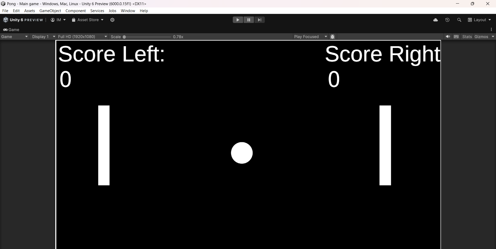

# Bing-Bong-Clone
A simple 2D Pong game clone built using Unity. This project is a recreation of the classic Pong game, showcasing 2D game development basics. It's easy to understand and a great starting point for beginners.

## Features

- *Player vs. Computer Mode:* Play against an AI opponent.
- *Classic Gameplay:* Simple controls and physics-based ball movement.
- *Score Tracking:* Displays scores for both players during the game.
- *Customizable:* Modify paddle size, ball speed, or game difficulty.

## Demo

## Getting Started

Follow these instructions to set up the game locally and start playing.

### Prerequisites

- Unity Hub installed
- Unity Editor version [your version here] or later

### Installation

1. Clone this repository:
   
   git clone https://github.com/your-username/pong-game-clone.git
   
2. Open Unity Hub and click on "Add" to import the project directory.
3. Select the project folder and let Unity load the assets.

### Running the Game

1. Open the MainScene (or equivalent) in the Unity Editor.
2. Click the "Play" button at the top of the Unity Editor to start the game.
3. To build the game for a specific platform:
   - Go to *File > Build Settings*.
   - Select your target platform and click "Build and Run".

## Controls

- *Player 1 (Left Paddle):*
  - Move Up: w
  - Move Down: s
- *Player 2 / Computer (Right Paddle):*
  - Move Up: Up Arrow or AI-controlled
  - Move Down: Down Arrow or AI-controlled

## Customization

Modify the game settings in Unity to change:
- Ball speed
- Paddle size
- Winning score

## Built With

- *Unity* - Game engine for logic and rendering.
- *C#* - Scripting language for game mechanics.
